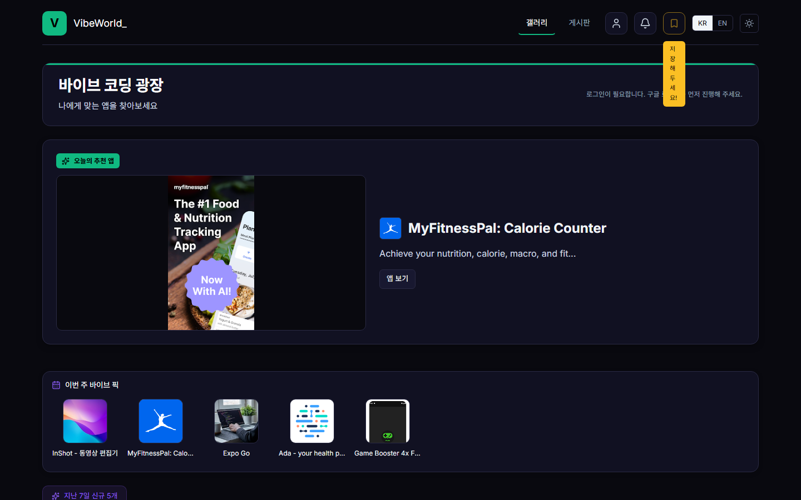
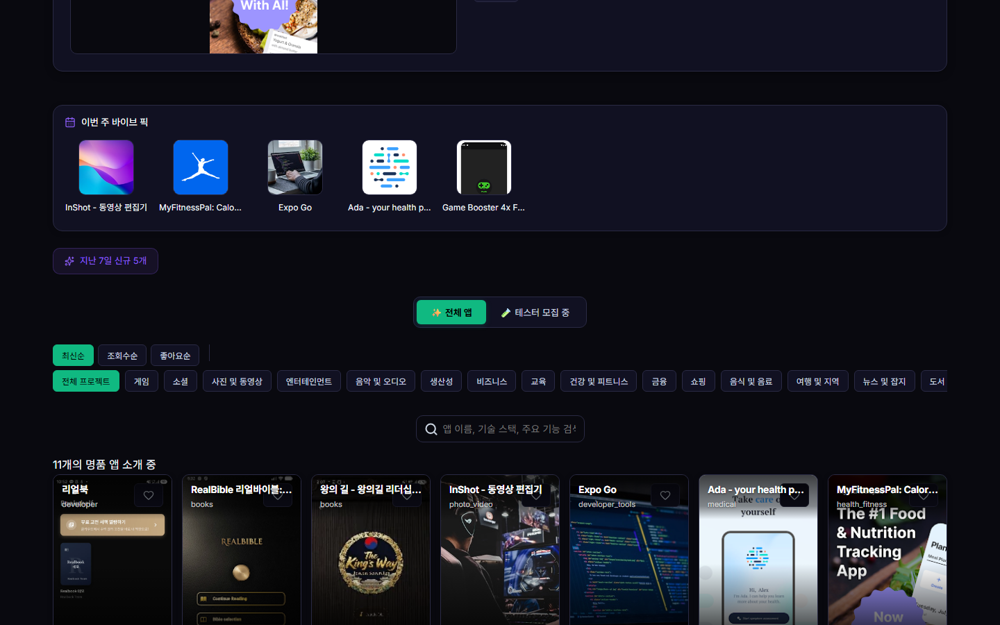
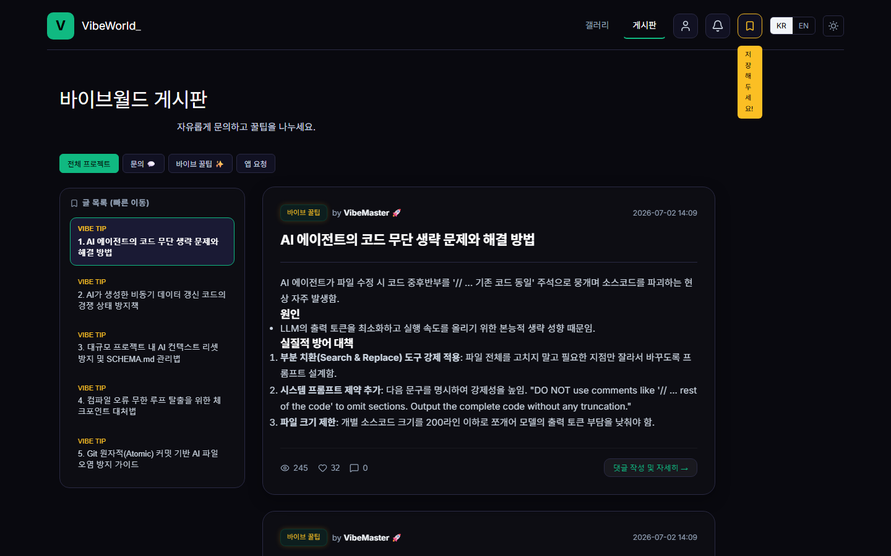
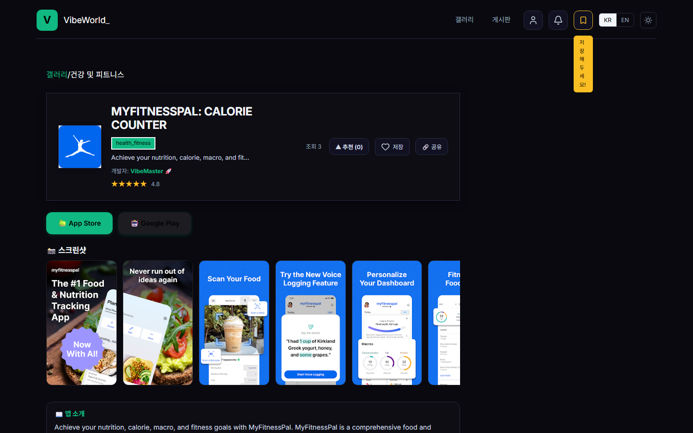

# VibeWorld

<p align="center">
  
  
  
  
  
  
  
  <a href="https://vibeworld.sharebible.org">
    
  </a>
</p>

<p align="center">
  <strong>앱 출시의 가장 큰 벽, 테스터 20명을 모아드립니다</strong><br>
  <sub>The hardest part of launching on Google Play — solved. Community-driven tester recruitment for vibe-coded apps.</sub>
</p>

<p align="center">
  <a href="https://vibeworld.sharebible.org">
    
  </a>
</p>

---

## 왜 VibeWorld인가

Google Play에 새 앱을 올리려면 **테스터 20명이 14일 이상** 앱을 사용해야 한다는 사실, 알고 계셨나요? 개인 개발자에게 이건 거의 불가능한 미션입니다. 친구, 가족, 지인을 총동원해도 20명을 채우기 어렵고, TestFlight도 피드백을 받으려면 실제 사용자가 필요합니다.

**VibeWorld는 이 문제를 풀기 위해 만들어졌습니다.**

앱을 등록하고 "테스터 모집"을 켜두기만 하면, 당신의 앱에 관심 있는 실제 사용자들이 자발적으로 테스터로 지원합니다. 반대로, 다른 개발자의 창의적인 앱을 먼저 경험하고 피드백을 주는 **얼리어답터**가 될 수도 있습니다.

> **Give & Take.** 먼저 다른 앱의 테스터로 참여하고, 그 후에 본인의 앱 테스터를 모집하세요. 이 순환 구조가 커뮤니티를 지속 가능하게 만듭니다.

## 화면 미리보기

<p align="center">
  
  
  
</p>

| 갤러리 메인 | 테스터 모집 필터 | 커뮤니티 게시판 |
|:--:|:--:|:--:|
| 22개 카테고리, 맞춤 피드 | 출시 전 앱만 골라보기 | 바이브 코딩 노하우 공유 |

<p align="center">
  
</p>

| 앱 상세 — 테스터 모집 배너 + 진행률 + 원클릭 지원 |
|:--:|

## 핵심 기능

### 개발자를 위한 것

| 기능 | 설명 |
|------|------|
| **테스터 모집** | 앱 등록 → "테스터 모집" 활성화 → 최대 20명 자동 매칭. TestFlight / Google Play Internal Test 링크 연결 |
| **듀얼패스 등록** | 출시된 앱(스토어 링크)과 출시 전 앱(테스터 모집) 각각 최적화된 등록 플로우 |
| **테스터 대시보드** | 지원자 명단, 이메일, 상태 관리. 신규 지원 시 실시간 알림 |
| **AI 모더레이션** | DeepSeek V4가 콘텐츠 품질을 자동 검수. 관리자 최종 승인 |
| **WebP 이미지 업로드** | 클라이언트 측 WebP 변환 → Supabase Storage 저장. 5MB 제한, 자동 리사이징 |

### 테스터 / 사용자를 위한 것

| 기능 | 설명 |
|------|------|
| **테스터 모집 필터** | 갤러리에서 "모집 중" 앱만 골라보기. 아직 세상에 나오지 않은 앱을 먼저 경험 |
| **원클릭 지원** | 앱 상세에서 "테스터 참여하기" 버튼 하나로 지원 완료 |
| **게시판** | 앱 요청, 바이브 코딩 팁, 자유 토론. 마크다운 지원 |
| **관심사 피드** | 선호 카테고리 기반 맞춤 앱 추천 |
| **한국어/English** | 전체 UI, 앱 설명, 게시판 완전 이중언어 |

### 게시판에서도 테스터 모집

게시글에 앱을 연결하면, 글을 읽는 누구나 "테스트 참여하기" 버튼으로 바로 이동할 수 있습니다. 바이브 코딩 팁을 공유하면서 자연스럽게 테스터도 모집하는 구조입니다.

## 기술 스택

| 기술 | 선택 이유 |
|------|----------|
| **React 19 + Vite 8** | 최신 React 동시성 기능. Vite의 빠른 HMR과 빌드 속도 |
| **Vanilla CSS** | Tailwind 의존성 없이 완전한 스타일 제어. CSS 커스텀 프로퍼티로 다크/라이트 테마 |
| **Supabase** | PostgreSQL + Auth + Storage + Edge Functions 통합. 무료 티어로 50k MAU까지 운영 가능 |
| **Cloudflare Pages** | 전 세계 엣지 배포. GitHub Actions CI/CD |
| **DeepSeek V4** | Anthropic 호환 API. AI 모더레이션 + 커뮤니티 시딩 + 앱 설명 재작성 |
| **Vitest + Playwright** | 500개 단위/통합 테스트 + E2E 크리티컬 플로우. 85%+ 커버리지 |

## 아키텍처

```
vibeworld/
├── src/
│   ├── components/      # 35+ 컴포넌트 (각각 테스트 포함)
│   ├── pages/           # 15개 페이지
│   ├── utils/           # API 클라이언트, 비즈니스 로직 (35+ 유틸)
│   ├── i18n/            # ko/en 번역 (1000+ 키)
│   ├── constants/       # 카테고리, 제한값, 블록리스트
│   └── styles/          # 4개 CSS 파일 (components, content, layout, responsive)
├── supabase/
│   ├── functions/       # 13개 Edge Functions (TypeScript)
│   │   └── _shared/     # JWT 인증, AI 재작성 핸들러
│   ├── migrations/      # 48개 DB 마이그레이션
│   └── config.toml
├── playwright.config.js # E2E 테스트
└── vite.config.js       # Vite + Vitest
```

### 데이터 흐름 & 보안

```
[사용자] → Cloudflare Pages (React SPA)
                ↓  PostgREST (검색어 메타문자 필터링)
         PostgreSQL + RLS (auth.uid() 기반 접근 제어)
                ↓
    ┌──────────┼──────────┐
  [Storage]   [Auth]  [Edge Functions]
  (WebP 이미지) (JWT)  (AI 모더레이션, 알림, 시드)
                      (Fail-closed JWT 검증)
```

## 기술적 도전과 해결

### 1. 테스터 모집 사전 조건 — Give & Take 순환

**도전**: 테스터만 받고 다른 앱에는 기여하지 않는 무임승차를 방지하면서, 진입 장벽은 낮게 유지.

**해결**:
- DB 트리거 `has_tester_participation()`: 다른 앱에 테스터로 먼저 참여한 이력이 있어야 본인 앱의 테스터 모집 가능
- `mapAppSubmitError.js`에서 트리거 에러를 친절한 i18n 메시지로 매핑
- 앱당 20명 제한 + 진행률 바 UI로 모집 현황 시각화

### 2. WebP 클라이언트 변환 + Supabase Storage

**도전**: 사용자가 업로드하는 임의 크기/형식 이미지를 무료 티어 내에서 안전하게 저장.

**해결**:
- Canvas API로 클라이언트 측 WebP 변환 (1200px max, quality 0.82, 5MB limit)
- `createObjectURL` / `revokeObjectURL` 라이프사이클 관리로 메모리 누수 방지
- Supabase Storage: RLS로 SELECT public, INSERT authenticated, DELETE owner only

### 3. 게시판 RLS 품질 게이트

**도전**: 글 수정을 허용하면서 VIBE_TIP 카테고리의 품질 유지.

**해결**:
- RLS UPDATE `WITH CHECK`: INQUIRY 자유 수정, VIBE_TIP은 title ≥5자 + content ≥80자
- `updatePost` API에서 `updated_at` 자동 갱신 + 작성자 프로필 join 반환
- `isAuthor` 체크로 수정 버튼 노출 제어

### 4. AI 비용 방어 — Community Seed 제한

**도전**: DeepSeek API로 커뮤니티 댓글 자동 생성 시 비용 통제.

**해결**:
- 앱당 lifetime 최대 2개 AI 댓글 (하드 리미트, 변경 불가)
- `communitySeedEligibility.js` 사전 검증
- `check_and_record_rate_limit` advisory lock으로 동시 실행 방지

## FAQ

<details>
<summary><strong>테스터 20명을 정말 무료로 모집할 수 있나요?</strong></summary>
네. VibeWorld가 테스터와 개발자를 연결해주는 것 자체는 완전 무료입니다. Google Play Console의 테스터 관리 기능과 연동하여 사용하시면 됩니다.
</details>

<details>
<summary><strong>어떤 앱이든 등록할 수 있나요?</strong></summary>
바이브 코딩으로 만든 앱이라면 어떤 플랫폼(Android, iOS, Web)이든 등록 가능합니다. 출시된 앱은 스토어 링크를, 출시 전 앱은 테스트 링크를 제출하면 됩니다. AI 모더레이션 + 관리자 승인 후 갤러리에 게시됩니다.
</details>

<details>
<summary><strong>테스터로 참여하면 어떤 점이 좋은가요?</strong></summary>
아직 세상에 나오지 않은 창의적인 앱들을 가장 먼저 경험할 수 있습니다. 개발자에게 피드백을 주면 앱의 방향성에 실질적인 영향을 미칠 수도 있습니다.
</details>

<details>
<summary><strong>심사는 얼마나 걸리나요?</strong></summary>
AI 자동 모더레이션 → 관리자 수동 승인 단계를 거칩니다. 보통 24시간 이내에 처리됩니다.
</details>

<details>
<summary><strong>왜 Vanilla CSS인가요?</strong></summary>
유틸리티 프레임워크 없이도 충분히 생산적인 스타일링이 가능함을 보여주기 위함입니다. 4개 CSS 파일로 모든 스타일을 관리하며, CSS 커스텀 프로퍼티로 테마를 전환합니다.
</details>

<details>
<summary><strong>셀프 호스팅이 가능한가요?</strong></summary>
네. Supabase 프로젝트 + Cloudflare Pages 계정만 있으면 전체 스택을 자체 운영할 수 있습니다.
</details>

---

<p align="center">
  <a href="https://vibeworld.sharebible.org">
    
  </a>
  <br><br>
  <sub>Built with vibe coding • Powered by Supabase & Cloudflare</sub><br>
  <sub><a href="mailto:musicbox26@gmail.com">Contact</a></sub>
</p>
